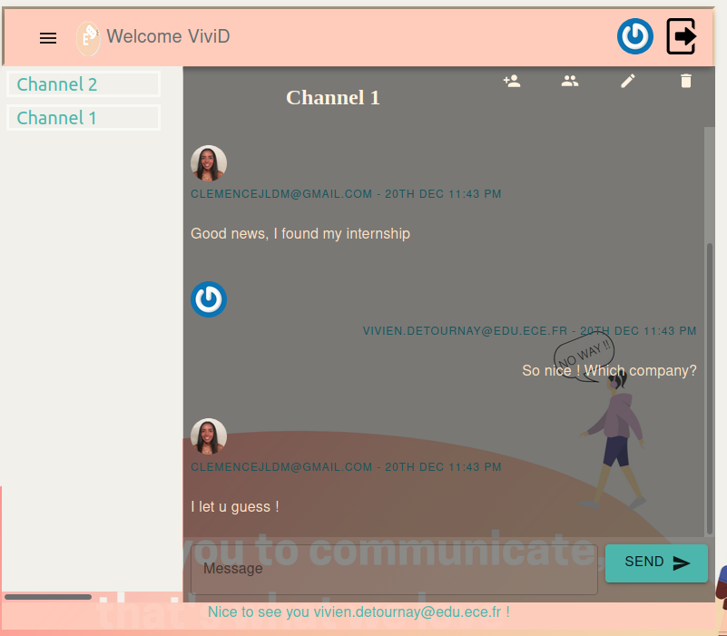

# ECE WebTech Chat

This is a chat application Vivien and Clemence created. Writing it allowed us to learn the basics and the not so basics features of backend and frontend web programing. It leverages Node.js and React as well as complementary technologies such as unit testing with Mocha and Should.js, embeded storage with LevelDB, REST APIs, ...

## Usage

### Initialization

In init file, we initialized three channels with messages and users, and three users (clemencejldm@gmail.com, vivien.detournay@edu.ece.fr, david@adaltas.com) so that the application seems full. To init :
```bash
$ cd back-end 
$ node bin/init
```

### Starting

Start the web application:

```bash
$ cd back-end 
$ node bin/start
Chat is waiting for you at http://localhost:3000
```
```bash
$ cd front-end 
$ npm start
```

## Fonctionalities

### Login

To authenticate users, we used an external provider with Oauth. The user must log with Github and Dex. 
* If the user is already in the database, he will log with OAuth. 
* If not, he will have to choose the button 'Create an account' and do so. First, he will be redirected throught Dex, and then, he will have to fiil a form with his informations.
When the user is logged in, it arrives to the welcome page.

### Welcome page

The welcome page displays the header, the channels and three buttons. Each one represent an action:

* Create a channel : when the user creates a channel, he just have to fill the name of the channel. Of course, he can cancel if he changed his mind.
The user that creates a new channel is automatically added to the channel's users tab with the role of admin. We considired that a user may want to create a channel without wanting to add friends, just to send files or information to himself. To add other user, he will have to do it directly in the diplayed channel.

* Invite a friend : the user can invite a friend that has not an account yet to join the application. Once he will have clicked on the button, he will have to fill his friend email. An email will be sent to this friend. We used the depedence 'emailjs-com'.

* Setting : this will display all information about the user. He can change the ones he wants. Note that the user can also access to his setting when clicking on his avatar in the header.

### Ressource access control

The user only gains access to the channel he created or to the channels he was invited to. The APIs returns the appropriate channels.

### Channel membership and access

Every request sent to the API server contains the user access token in the HTTP header with its identity. Once the token is validated by the authentication middleware, the user ID is associated with the created channel.

### Channel

When the user is on his channel, he can see all the messages of the channel. On the top, he can see the name of the channel and three or four buttons according to his role in the channel. The tree permanent are:

* Add a user to channel : every member of the channel can add a user to it by filling his friend's email.

* See member(s) of the channel : this will display all members with their role (admin or member).

* Change the name of the channel : any member of the channel can change the name of it.

The last button, only visible by the admin of the channel is the one that allows him to delete the channel. Once he will have clicked on it, the channel will be deleted.

### Messages

The user will also be able to modify or delete his messages, but ONLY HIS. To do so, he will have to click on the message he wants to modify/delete. Then, a modal will appear, allowing him to write a new message and replace the older one or delete the message.

Also, all the messages sended by the user will be displayed on the right so that the reding of the conversation is clearer.

Moreover, next to each message, the avatar of the author is displayed.

### Avatar

The avatar can be changed in the settings. The user have three different ways to choose one:

* Choose among 8 avatars proposed by the application.
* Choose his gravatar.
* Upload an image for his computer. This functionnality isn't completly working : the problem comes from the path.

The image default is the gravatar (if the user does not have one, a default image will be sent).

### Bonus

* Send email to invited a friend to join the application.
* Messages showed on the right if they are from the current user.
* Avatar displayed next to messages

### Preview



## Authors

Vivien DETOURNAY and Clémence JEAN-LOUIS DIT MONTOUT
SI inter Gr01
